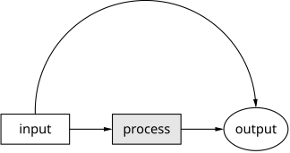
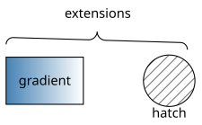

```{r setup, include = FALSE}
knitr::opts_chunk$set(collapse = TRUE, comment = "#>", eval = FALSE)
```

rpic renders diagrams written in Brian Kernighan's **pic** picture-drawing
language: you describe a drawing by *walking around a plane dropping
primitives* — boxes, circles, lines, arrows — with relative positioning
doing the layout for you. The engine is pure Rust (no troff, no LaTeX, no
system dependencies) and outputs SVG, PNG and PDF.

All diagrams in this vignette were pre-rendered with `rpic_svg()` — the code
chunks show exactly the source that produced each figure. The full language
reference, extension pages and a live playground are at
[rpic.dev](https://rpic.dev).

## A first picture

Primitives placed in sequence flow in the current direction (right, by
default); `arrow` connects them; `arc` bends between named positions:

```{r}
library(rpic)

svg <- rpic_svg('
boxht = 0.35; boxwid = 0.8
A: box "input"
arrow
box "process" fill 0.9
arrow
E: ellipse "output"
arc cw -> from A.n to E.n
')
```



## Positioning

Objects can be labelled (`A:`), addressed by compass corners (`.n`, `.e`,
`.c`, …) or by ordinals (`last circle`, `2nd box`), and placed with
expressions — including fractions of the way between two points:

```{r}
rpic_svg('
A: box "A" wid 0.6 ht 0.4
B: box "B" wid 0.6 ht 0.4 at A + (1.6, 0)
line dashed from A.e to B.w
circle rad 0.06 fill 0 at 1/2 between A.e and B.w
"midpoint" at last circle.s below
arrow from A.n up 0.3 then right 1.6 then down 0.3 to B.n
"the long way" at 1/2 between A.n and B.n + (0, 0.42)
')
```


## Programmability

pic is a little language: `for`/`if`, variables, `define` macros with
`$1…$9`, and `sprintf` are all built in:

```{r}
rpic_svg('
for i = 0 to 5 do {
  circle rad 0.12 fill i/6 at (i * 0.4, 0)
}
')
```


## TeX math labels

With `texlabels = TRUE` (or `texlabels = 1` in the source), a label written
entirely as `$…$` is typeset as TeX math, natively — KaTeX-grade quality
with exact metrics, so boxes `fit` around formulas correctly. Write TeX
commands with a single backslash in the pic source (escaped as `\\` inside
an R string):

```{r}
rpic_svg('
box "$\\frac{1}{2\\pi}\\int_{-\\infty}^{\\infty} f(t)\\,e^{-i\\omega t}\\,dt$" fit
', texlabels = TRUE)
```


## rpic extensions

Beyond classic pic, opt-in extensions cover linear `gradient` fills, `hatch`
patterns, curly `brace` annotations, `margin`, `fit`, `opacity`, layers
(`behind`) and more — each documented with live examples at
[rpic.dev](https://rpic.dev/docs/extensions/margin/). They are inert for
classic input:

```{r}
rpic_svg('
B: box wid 0.9 ht 0.55 gradient "steelblue" "white"
"gradient" at B.c
C: circle rad 0.3 hatch hatchangle 45 at B.e + (1.0, 0)
"hatch" at C.s below
brace from B.nw + (0, 0.15) to C.ne + (0, 0.15) up "extensions"
')
```



## Errors you can point at

Compile failures raise a classed `rpic_error` condition whose `info` field
carries the structured diagnostic — position (always relative to *your*
source), kind, and a did-you-mean hint:

```{r}
tryCatch(
  rpic_svg("bxo", circuits = TRUE),
  rpic_error = function(e) list(line = e$info$line, hint = e$info$hint)
)
#> $line
#> [1] 1
#> $hint
#> [1] "did you mean `box`?"
```

## Where next

- `vignette("circuits")` — the native circuit-element library;
- `vignette("class-and-animate")` — CSS class hooks and the animation
  manifest;
- `rpic_register_knitr()` — write pic directly in R Markdown / Quarto
  chunks;
- [rpic.dev](https://rpic.dev) — the full language documentation.
